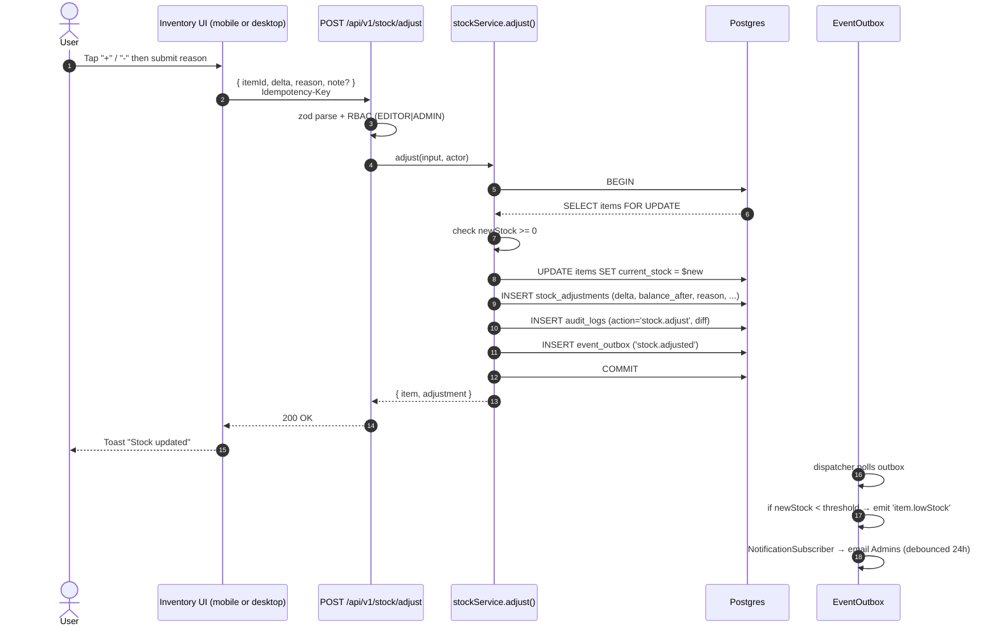
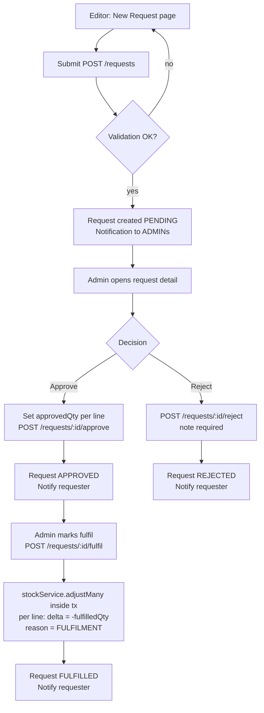
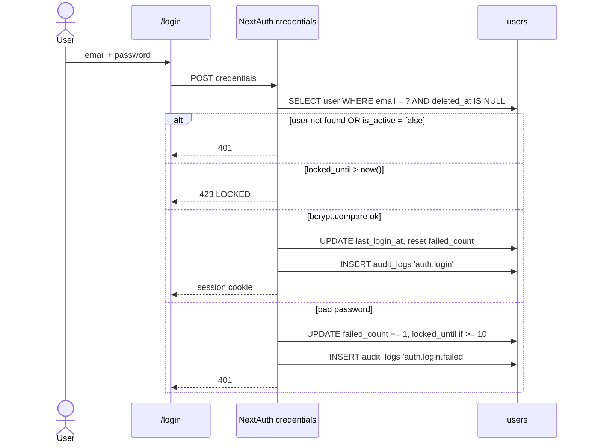

# 07 — Workflow Diagrams

Mermaid diagrams for the three workflows that span more than one screen.

## 1. Request lifecycle

```mermaid
stateDiagram-v2
    [*] --> PENDING : Editor submits request
    PENDING --> APPROVED : Admin approves\n(sets approvedQty per line)
    PENDING --> REJECTED : Admin rejects (note required)
    PENDING --> CANCELLED : Requester (own) or Admin cancels
    APPROVED --> FULFILLED : Admin marks fulfilled\n(stock decremented; FULFILMENT adjustments written)
    APPROVED --> CANCELLED : Admin cancels (note required)
    REJECTED --> [*]
    CANCELLED --> [*]
    FULFILLED --> [*]
```



Invariants:
- `approvedQty <= requestedQty` per line.
- `fulfilledQty <= approvedQty` per line.
- Stock is decremented at FULFILMENT only.
- Partial fulfilment: a line can have `fulfilledQty < approvedQty`; the request transitions to `FULFILLED` once **every line** is fully fulfilled or the admin closes it (closing zero-fulfilled lines moves them to "deferred" — out of scope v1; we keep the line on the audit trail and the request transitions only when all lines are either fulfilled or set to 0 by the admin).

## 2. Stock adjustment



## 3. Approval flow



## 4. Low-stock & near-expiry scans (scheduled)

```mermaid
flowchart LR
  Cron[node-cron: every 15 min] --> Scan[stockService.scanLowStock]
  Scan --> Q[SELECT items WHERE current_stock < reorder_threshold AND status='ACTIVE']
  Q --> Loop{For each item}
  Loop --> Dedup[Skip if alerted in last 24h]
  Dedup --> Out[INSERT event_outbox 'item.lowStock']
  Out --> Disp[Dispatcher → email admins]

  Cron2[node-cron: 09:00 daily] --> Expire[stockService.scanNearExpiry]
  Expire --> EQ[SELECT items WHERE expiry_date <= now() + 30d]
  EQ --> Digest[Aggregate into one digest email per admin]
```

## 5. Login & lockout


